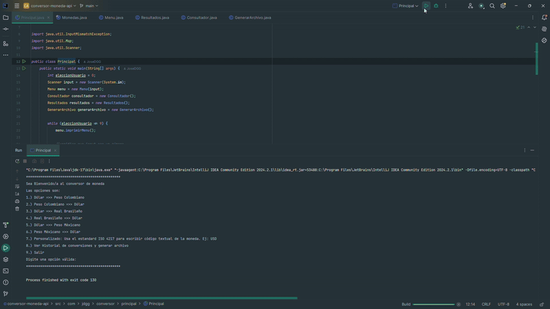
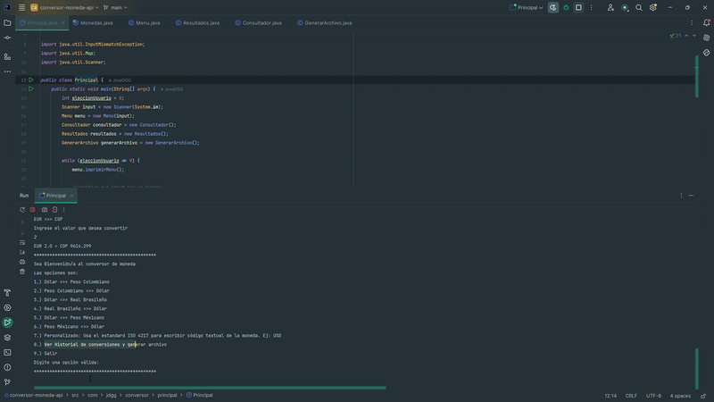
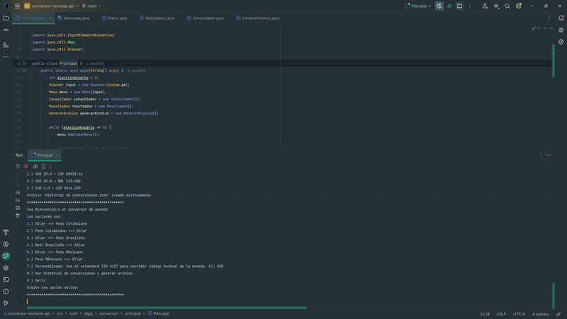

# Conversor de Divisas

Este es un proyecto en Java que permite realizar conversiones de divisas en tiempo real, sean predeterminadas o personalizadas utilizando la API de ExchangeRate-API. El programa también guarda un historial de conversiones y puede exportar los resultados a un archivo JSON para un fácil seguimiento.

## Características

- Conversión de varias divisas con soporte para:
  - Dólar a Peso Colombiano
  - Peso Colombiano a Dólar
  - Dólar a Real Brasileño
  - Real Brasileño a Dólar
  - Dólar a Peso Mexicano
  - Peso Mexicano a Dólar
  - Opción personalizada usando el estándar ISO 4217 para otras divisas.
- Ver y Guardar un historial de conversiones.
- Exportación del historial de conversiones en formato JSON.

## Estructura del Proyecto

El proyecto está organizado en varias clases:

- **Principal**: Clase principal para ejecutar el programa.
- **Menu**: Clase que maneja la interacción con el usuario y permite elegir opciones de conversión por defecto.
- **Consultador**: Clase para realizar las llamadas a la API de ExchangeRate-API y obtener las tasas de conversión.
- **Resultados**: Clase para mostrar los resultados de las conversiones, guardar y gestionar el historial de conversiones.
- **GenerarArchivo**: Clase para exportar el historial de conversiones en un archivo JSON.

## Uso

1.  Ejecuta el programa y selecciona una opción de conversión.
2.  Ingresa el valor que deseas convertir.
3.  Visualiza el resultado en pantalla.
4.  si deseas realizar una consulta personzalidad seleccionas la opción correspondiente pero asegurate de que el código estandarizado sea el correcto.
5.  Si deseas ver el historial de conversiones, selecciona la opción correspondiente en el menú.
6.  El historial de conversiones se guarda en un archivo JSON, llamado Historial de conversiones.json, en el directorio del proyecto.
7.  El programa maneja excepciones para evitar frenar el programa por ello no se detendrá hasta seleccionar la opción correspondiente

## Video demostrativo

**GENERAL**

GIF de la ejecución del programa.

**OPCIONES 1 A 6. Predeterminados**

Apreciación de 2 de las 6 opciones predeterminadas.

**OPCIÓN 7. Personalizado**

Demostración de la opción predeterminada en el cuál es posible escoger el código de la moneda de forma personalizada.

**OPCIÓN 8. Historial**

El historial es persistente por tanto así ocurran errores estos no serán guardados ni afectarán como se guarda ni el archivo generado.

**MANEJO DE ERRORES**

Los errores han sido manejados con try catch, if y lógica de programación para que no puedan detener el programa ni generar acciones no deseadas.

